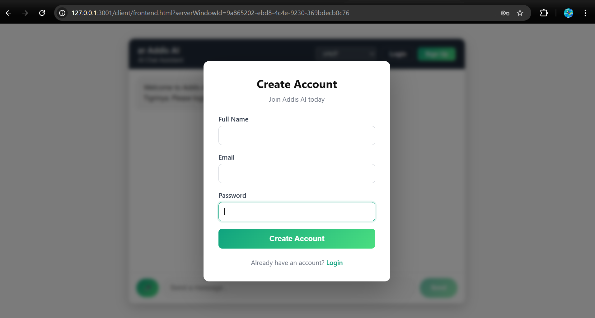

# Amharic Chatbot

An Amharic conversational chatbot built with **Node.js**, **MongoDB**, and the **Addis AI API**.  
The application allows users to create accounts, log in, and chat in Amharic with AI-generated responses.

This project provides a simple web interface and backend server that connects users to the **Addis AI API**.

---

## Demo

Example interface:



Users can:

- Create an account
- Log in
- Send messages in Amharic
- Receive AI-generated responses

---

## Features

- Amharic conversational chatbot
- AI responses powered by **Addis AI API**
- User authentication using **JWT**
- Conversation storage using **MongoDB**
- REST API backend built with **Node.js / Express**
- Simple web chat interface

---

## Tech Stack

**Backend**
- Node.js
- Express.js
- MongoDB
- Mongoose
- JWT Authentication

**Frontend**
- HTML
- CSS
- JavaScript

**AI Provider**
- Addis AI API

---

## Project Structure

```
Amharic-Chatbot
│
├── client
│   └── frontend.html
│
├── server
│   ├── controllers
│   ├── models
│   ├── routes
│   ├── middleware
│   ├── config
│   └── server.js
│
├── screenshot.png
└── README.md
```

---

## Requirements

Make sure you have the following installed:

- Node.js (v18+ recommended)
- MongoDB
- npm

Download MongoDB:

https://www.mongodb.com/try/download/community

---

## Installation

Clone the repository:

```bash
git clone https://github.com/Nmbaby/Amharic-Chatbot.git
```

Navigate into the project:

```bash
cd Amharic-Chatbot
```

Install dependencies:

```bash
cd server
npm install
```

---

## Environment Variables

Inside the **server** folder create a `.env` file.

Example:

```
MONGODB_URI=mongodb://localhost:27017/addis-chatbot
JWT_SECRET=your_jwt_secret_here
JWT_EXPIRE=7d
ADDIS_API_KEY=your_addis_api_key_here
PORT=3000
NODE_ENV=development
```

### Environment Variable Description

| Variable | Description |
|--------|--------|
| MONGODB_URI | MongoDB database connection |
| JWT_SECRET | Secret used to sign JWT tokens |
| JWT_EXPIRE | Token expiration duration |
| ADDIS_API_KEY | API key used to access Addis AI |
| PORT | Server port |
| NODE_ENV | Application environment |

⚠️ Do not commit `.env` to GitHub.

Add this to `.gitignore`:

```
.env
```

---

## Running the Application

Start MongoDB first.

Then start the server:

```bash
cd server
npm start
```

or for development:

```bash
npm run dev
```

The server will start at:

```
http://localhost:3000
```

Open the frontend:

```
http://localhost:3000/client/frontend.html
```

---

## Example API Request

Example request:

```bash
curl -X POST http://localhost:3000/api/chat \
-H "Content-Type: application/json" \
-d '{"message":"ሰላም"}'
```

Example response:

```json
{
  "reply": "ሰላም! እንዴት ልረዳ?"
}
```

---

## How the Chatbot Works

1. User sends a message from the frontend.
2. The backend receives the message.
3. The backend sends the message to the **Addis AI API**.
4. Addis AI generates the response.
5. The response is returned to the user.

---

## Future Improvements

Possible improvements:

- Conversation memory
- Amharic document question answering
- Voice input/output
- Improved UI
- Docker deployment

---

## License

MIT License
